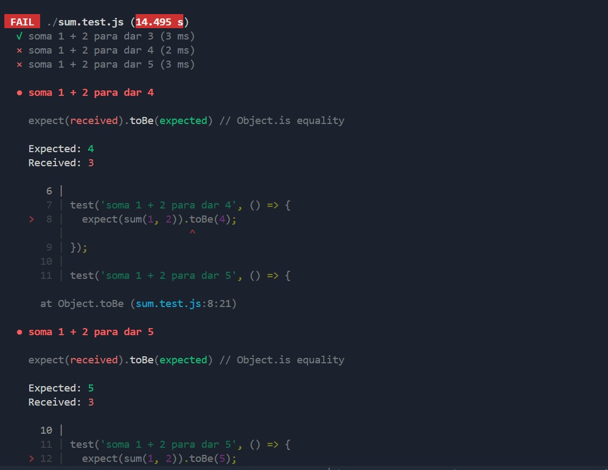

# Relatório - Configuração do Husky

## ✅ Objetivo

Implementar hooks com Husky para garantir qualidade antes de commits e pushes no repositório.

## 🔧 Tecnologias Utilizadas

- Husky
- ESLint
- Jest
- Node.js

## 📦 Instalação de Dependências

```bash
npm install --save-dev husky eslint jest

```
## ⚙️ Configuração do Projeto

### Inicialização

```bash
npm init -y
```

### ESLint
```bash
npx eslint --init
```
Configuração de exemplo adicionada ao `package.json`:

```json
"scripts": {
  "lint": "eslint .",
  "build": "echo 'Compilação simulada com sucesso!'",
  "test": "jest",
  "prepare": "husky install"
}
```

## 🛠️ Configuração do Husky

### Inicialização
```bash
npx husky install
```
### Adicionar hook de pré-commit
```bash
npx husky add .husky/pre-commit "npm run lint && npm run build"
```

### Adicionar hook de pré-push
```bash
npx husky add .husky/pre-push "npm test"
```

### 🧪 Código de Exemplo para Teste

### `sum.js`
```js
function sum(a, b) {
  return a + b;
}
module.exports = sum;
```
### `sum.test.js`
Neste teste, intencionalmente criei casos incorretos para verificar se o hook de pré-push realmente bloqueia pushes com testes quebrados.

```js
const sum = require('./sum');

test('1 + 2 = 3 (correto)', () => {
  expect(sum(1, 2)).toBe(3);
});

test('1 + 2 = 4 (incorreto de propósito)', () => {
  expect(sum(1, 2)).toBe(4);
});

test('1 + 2 = 5 (incorreto de propósito)', () => {
  expect(sum(1, 2)).toBe(5);
});

```

Como esperado, ao tentar dar um git push, os testes falharam e o Husky impediu o envio do código.

## 📸 Evidências (Print dos Hooks Funcionando)

### Pré-push (testes falhando propositalmente)



O screenshot acima mostra que os testes falharam, como esperado, e o push foi bloqueado com sucesso. Isso comprova que o Husky está corretamente interceptando e validando o código antes de ser integrado ao repositório remoto.

## ✅ Resultado

Todos os hooks foram configurados corretamente, garantindo que:

- O código seja lintado e compilado antes dos commits.

- Os testes rodem antes dos pushes.

- Nenhum commit ou push com falhas passe despercebido.